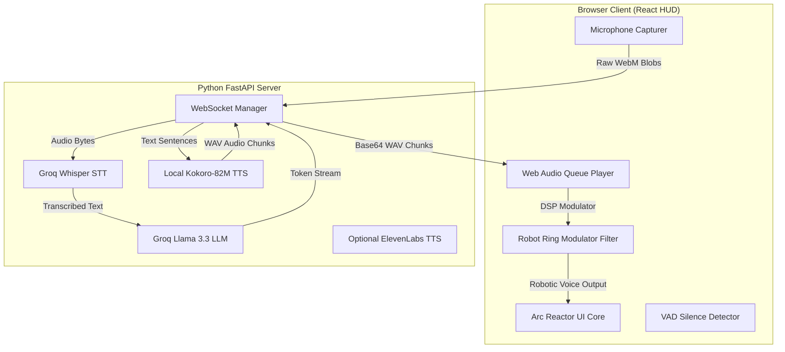

# Monolithic Multilingual Jarvis AI Voice Assistant 🕶️⚡

A high-performance, real-time AI voice assistant inspired by Iron Man's JARVIS. Built with a futuristic glassmorphic React frontend HUD and a lightning-fast FastAPI backend WebSocket routing core (<700ms latency). The application compiles into a single monolithic Docker container designed to deploy seamlessly to Hugging Face Spaces.

## 🛠️ System Architecture & Tech Stack



- **Hosting Platform:** Hugging Face Spaces (Docker SDK runtime).
- **Frontend UI:** React + Vite (Vanilla CSS, custom Orbitron + Share Tech Mono typography).
- **Backend API Framework:** Python FastAPI (Uvicorn HTTP & Websockets).
- **Speech-to-Text (STT):** Groq Cloud API using `whisper-large-v3-turbo`.
- **Cognitive Engine (LLM):** Groq Cloud API using `llama-3.3-70b-versatile` with stream sentence tokenization.
- **Text-to-Speech (TTS):** 
  - **English:** Local, zero-cost `Kokoro-82M` (loaded via `kokoro-onnx` CPU engine in-container).
  - **Hindi & Telugu:** Native device `SpeechSynthesis` browser fallback (100% free, high quality, zero api lag).
  - **Premium Multilingual:** Optional ElevenLabs Cloud API (via WebSocket stream bypass) if key is provided.

---

## ✨ Key Technical Solutions Implemented

### 1. Dual Activation & Client-side VAD
- **Arc Reactor Core:** Manual push-to-talk button styled as a pulsing Iron Man Arc Reactor using layered SVG vectors and CSS keyframe animations.
- **Wake Word Recognition:** Active background web SpeechRecognition monitoring for the phrase *"Hey Jarvis"* or *"Jarvis"*. Starts microphone capture immediately upon detection.
- **Voice Activity Detection (VAD):** Client-side analyser node checks the Root Mean Square (RMS) volume of user speech. If silence is detected for more than 1.8 seconds, recording automatically stops and uploads to the server, removing manual click overhead.

### 2. Sentence-level Streaming TTS
To keep latency under 700ms, the FastAPI server tokenizes LLM streaming outputs into complete sentences on-the-fly. The backend synthesizes each sentence *immediately* and streams it back as a base64 WAV package. The browser queue decodes and plays each chunk in a continuous audio sequence, meaning Jarvis starts speaking the beginning of the reply while the LLM is still generating the end!

### 3. Strict Language-Matching Prompting
System instructions direct the Llama 3.3 model to respond in the script matching the user's input (Devanagari for Hindi, Telugu characters for Telugu, and Latin script for colloquial Hinglish/Teluglish). 

### 4. Client-side Robotic Audio Filter
When "Robot" mode is active, the React Audio Player instantiates an audio graph containing:
- A `BiquadFilterNode` peaking mid-high metallic frequencies (1200Hz, Q=8, Gain=12dB).
- A feedback delay loop (15ms delay, 35% feedback) to simulate a steel metal chamber.
- An amplitude modulator `GainNode` driven by a `sine` carrier oscillator at 55Hz (creating a low metallic ring modulation hum).
This runs instantly in the browser's Web Audio context with zero server processing latency.

---
<!-- 
## 🚀 Local Installation & Setup

### Prerequisites
- Node.js (v18+)
- Python (3.10+)
- FFmpeg (installed and added to System PATH)

### 1. Backend Setup
1. Clone the repository and navigate to the project root:
   ```bash
   cd Jarvis
   ```
2. Create a Python virtual environment and activate it:
   ```bash
   python -m venv venv
   # On Windows (PowerShell):
   .\venv\Scripts\Activate.ps1
   # On Linux/macOS:
   source venv/bin/activate
   ```
3. Install Python dependencies:
   ```bash
   pip install -r requirements.txt
   ```
4. Download the Kokoro ONNX model and voices binary files:
   ```bash
   python download_model.py
   ```
   *This downloads `kokoro-v1.0.onnx` and `voices-v1.0.bin` (~330MB total) into a `/model` folder.*

5. Create a `.env` file in the project root:
   ```env
   GROQ_API_KEY=your_groq_api_key_here
   # Optional
   ELEVEN_LABS_API_KEY=your_elevenlabs_key_here
   ```

### 2. Frontend Setup (Optional for source changes)
We have pre-built the frontend assets into the `/static` directory so the server runs out-of-the-box. If you want to modify the React code, re-compile it:
1. Navigate to the frontend folder:
   ```bash
   cd frontend
   ```
2. Install Node packages:
   ```bash
   cmd.exe /c npm install
   ```
3. Build Vite static assets:
   ```bash
   cmd.exe /c npm run build
   ```
4. Copy compiled assets back to root:
   ```bash
   cd ..
   cmd.exe /c xcopy /E /I /Y frontend\dist static
   ```

### 3. Launching the App
Run the FastAPI development server:
```bash
uvicorn main:app --reload --host 127.0.0.1 --port 7860
```
Open your browser and navigate to `http://127.0.0.1:7860` to access the Jarvis Holographic interface!

---

## 🐳 Hugging Face Spaces Docker Deployment

Hugging Face Spaces automatically builds your space using the `Dockerfile` in the root.

1. **Create Space on Hugging Face:**
   - Go to Hugging Face -> **New Space**.
   - Select **Docker** SDK.
   - Choose **Blank** template.
2. **Add Repository Secrets:**
   - Go to your Space **Settings** -> **Variables and secrets**.
   - Create a Secret named `GROQ_API_KEY` and paste your key.
   - (Optional) Create a Secret named `ELEVEN_LABS_API_KEY` for premium voices.
3. **Deploy Repository:**
   - Initialize git, commit your files, and push to the Hugging Face Spaces remote:
     ```bash
     git init
     git remote add origin https://huggingface.co/spaces/YOUR_USERNAME/YOUR_SPACE_NAME
     git add .
     git commit -m "Deploying monolithic Jarvis Assistant"
     git push -u origin main --force
     ```
4. Once pushed, Hugging Face will trigger the multi-stage Docker build, pre-bake the Kokoro models, compile React static scripts, and spin up your monolithic container on port 7860 automatically!

5. for ui changes in python file
npm run build
xcopy /E /I /Y frontend\dist static
uvicorn main:app --reload --host 127.0.0.1 --port 7860
python download_model.py 


docker build -t jarvis-assistant .
docker run -p 7860:7860 -e GROQ_API_KEY="gsk_your_key_here" jarvis-assistant
docker run -p 7860:7860 --env-file .env jarvis-assistant
http://127.0.0.1:7860/-->